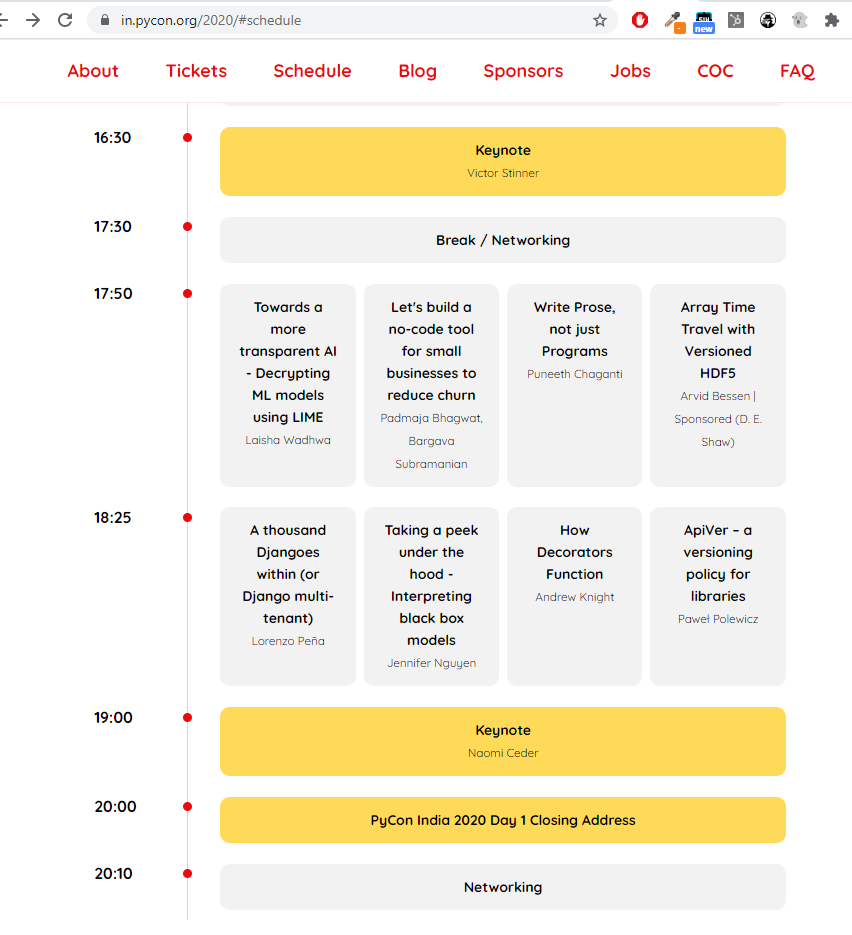
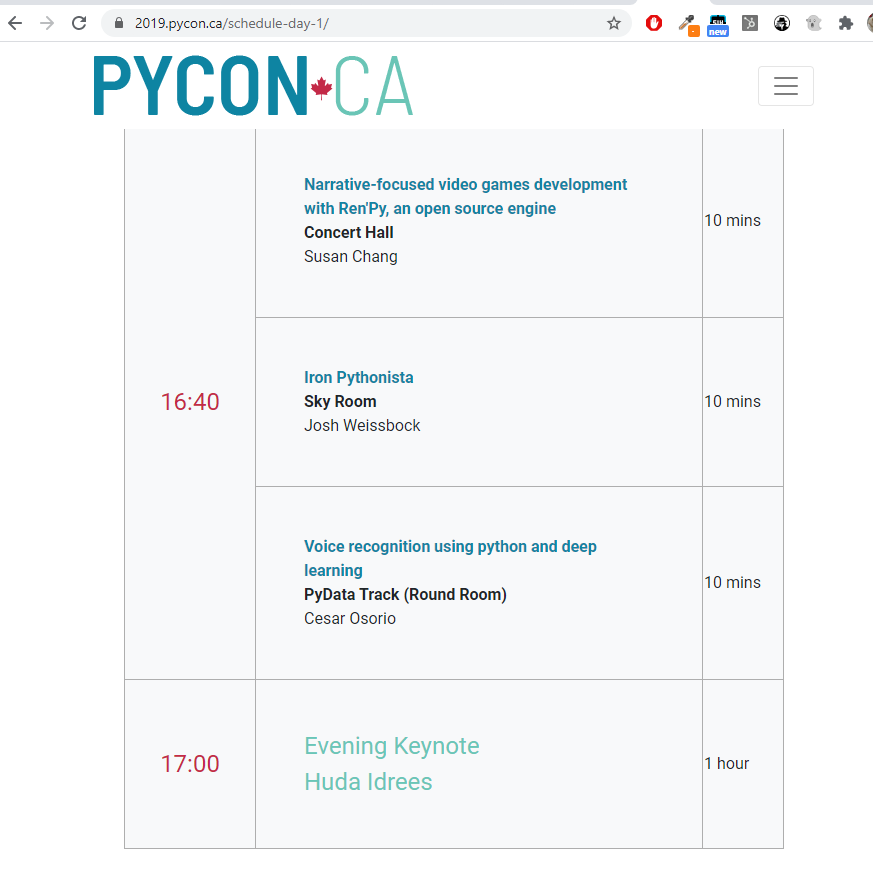

# pycon-game-dev-talks
Slides for my various talks at PyCons and other conferences on game development.

## PyCon India 2020
The most comprehensive version of the talk since the duration was 30 minutes.  
Slides: [link](https://github.com/susan-shu-c/pycon-game-dev-talks/blob/main/PyCon_India_2020_Narrative_Video_Games_RenPy.pdf)  
Talk video: [link](https://www.youtube.com/user/inpycon) (organizers confirmed they will upload it soon)  
Talk outline in CFP: [link](https://in.pycon.org/cfp/2020/proposals/narrative-focused-video-games-development-with-renpy-an-open-source-engine~az0qd/)  

## PyLadies Chennai 2020
See talk recording here: [YouTube link](https://youtu.be/QMnMKBzYnFM?t=3325)  
Slides: [link](https://github.com/susan-shu-c/pycon-game-dev-talks/blob/main/PyLadies_Chennai_2020_Narrative_Video_Games_RenPy.pdf)  

## PyCon Canada 2019
* Shorter version of the talk  
Slides: [link](https://github.com/susan-shu-c/pycon-game-dev-talks/blob/main/PyCon_Canada_2019_Narrative_Video_Games_RenPy.pdf)  

